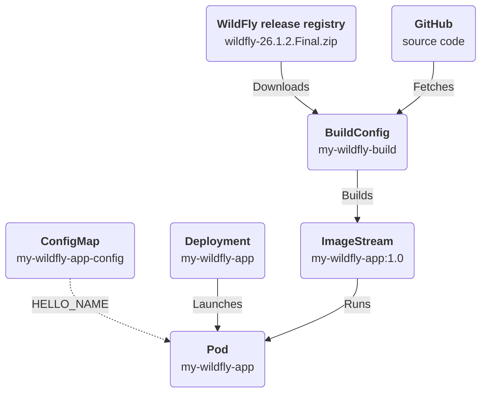

# Building and deploying a WildFly application in OpenShift 
An OpenShift deployment to build and install an `Hello World` application on top of a
binary distribution of `WildFly` in OpenShift.

* The `my-wildfly-build` ConfigMap downloads the WildFly release `26.1.2.Final` from the relase registry, builds
the application source code fetched from GitHub and finally generates the `my-wildfly-app:1.0` ImageStream
* A `my-wildfly-app` Deployment runs the image and injects a runtime environment variable `HELLO_NAME` from
  the `my-wildfly-app-config` ConfigMap



## Application source code
The `Hello World` application was forked from the original [JBoss EAP Quickstarts repository](https://github.com/jboss-developer/jboss-eap-quickstarts/tree/7.4.x/helloworld) to include an optional environment property `HELLO_NAME`:

https://github.com/dmartinol/jboss-eap-quickstarts/commit/119fe9b04a900c7ac7d6d9253d703bdbfebf2ea7

## Building and installing the application
To build the `Hello World` application and generate the image in the current namespace, run:
```bash
oc apply -f build.yaml
```

To install the application using the generated image, run:
```bash
oc apply -f deployment.yaml
```
Note: the previous command also creates the required RBAC resources.

### Test the application
Run this command to execute the application:
```bash
HELLOWORLD=$(oc get routes helloworld  -o=jsonpath='{.status.ingress[0].host}') && curl $HELLOWORLD/helloworld/HelloWorld
```

Run these commands to update the configuration in the `my-wildfly-app-config`  ConfigMap and restart the deployment of a new Pod:
```bash
oc patch cm my-wildfly-app-config -p='{"data":{"HELLO_NAME": "Mike"}}'
oc delete pod -l deployment=my-wildfly-app
```

Finally, run again this command to validate the change:
```bash
HELLOWORLD=$(oc get routes helloworld  -o=jsonpath='{.status.ingress[0].host}') && curl $HELLOWORLD/helloworld/HelloWorld
```